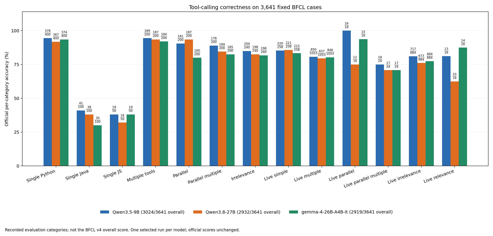
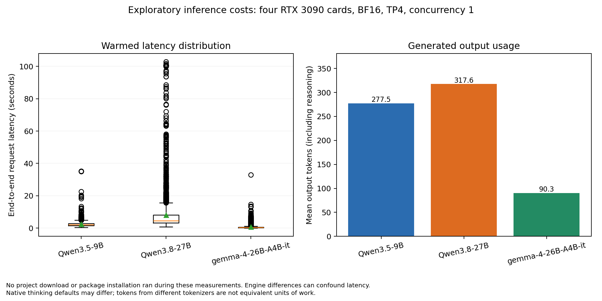

# Local open-model tool-calling study

A reproducible, exploratory AI engineering project by Jiaming Yue, comparing three locally deployed open-weight models with the official Berkeley Function Calling Leaderboard (BFCL) data and per-entry scoring code.

**All three models completed all 3,641 cases in the 13 official single-turn categories.** Scoring and report generation finished on 6 October 2026 at 05:13 Beijing time. This is a completed single-turn baseline, not an enterprise production deployment or a complete BFCL v4 leaderboard evaluation. No adaptation or fine-tuning has been evaluated.

## Completed results

| Model | Correct / cases | Accuracy | Mean latency | P95 latency | Outputs reaching token cap |
|---|---:|---:|---:|---:|---:|
| Qwen/Qwen3.5-9B | 3024/3641 | 83.05% | 2.486 s | 4.824 s | 4 |
| Qwen/Qwen3.8-27B | 2932/3641 | 80.53% | 8.138 s | 22.284 s | 21 |
| google/gemma-4-26B-A4B-it | 2919/3641 | 80.17% | 0.805 s | 3.431 s | 1 |

All 10,923 measured requests completed without inference request errors. Output-length truncation is separate from request failure. Official scores are retained unchanged, including truncated responses that pass the official relevance/irrelevance check.

- **[Read complete results on GitHub](reports/README.md)**: overall metrics and all 13 category scores.
- **[Browse all 3,641 cases](reports/cases/README.md)**: small pages with questions, accepted answers and all three model outputs.
- [Small metrics CSV](reports/metrics.csv) and [category metrics CSV](reports/category-metrics.csv).





The original large HTML/CSV/JSONL files remain available for download and reproducibility. They are not the browser-reading entry point: GitHub does not provide an interactive HTML report preview. See [downloads and run records](reports/README.md#downloads-and-reproducibility).

## Coverage and scoring

These categories and questions come from BFCL. Every entry is retained in original category/file order, without sampling or deduplication.

| Official category | Cases |
|---|---:|
| `simple_python` | 400 |
| `simple_java` | 100 |
| `simple_javascript` | 50 |
| `multiple` | 200 |
| `parallel` | 200 |
| `parallel_multiple` | 200 |
| `irrelevance` | 240 |
| `live_simple` | 258 |
| `live_multiple` | 1,053 |
| `live_parallel` | 16 |
| `live_parallel_multiple` | 24 |
| `live_irrelevance` | 884 |
| `live_relevance` | 16 |
| **Total per model** | **3,641** |

BFCL v4 is pinned to commit `6ea57973c7a6097fd7c5915698c54c17c5b1b6c8`. The [dataset manifest](configs/datasets/full_single_turn.manifest.json) records source-file hashes and the assembled SHA256: `b65e4e4a34defe80e6371af08b3d1391cb39056f03fa245fec9f2a949d27b5c6`.

Official prompt files, tool-schema conversion, function-call decoding and per-entry checkers are used unchanged. The local adapter registers endpoints without initializing remote SDK clients. Native model chat templates replace legacy embedded handler templates; this serving choice is recorded. Java/JavaScript use the official language-specific AST checks. Relevance/irrelevance checks evaluate presence/absence of valid calls; `live_relevance` does not validate arguments. Tool calls are evaluated as outputs, not executed.

Accuracy is case-weighted across these categories. **Multi-turn, memory, web search and prompting-only format-sensitivity tasks are excluded. This is not the BFCL v4 overall leaderboard score.** The dataset is reconstructed from the pinned upstream checkout rather than redistributed as an independently owned dataset.

## Hardware and protocol

One Linux host with four RTX 3090 GPUs (24 GiB each), NVIDIA driver 560.35.03 and no NVLink was used. Tensor parallelism uses PCIe/NUMA connections. Models ran sequentially, each using all four cards. No project downloads or package installation ran during measurement. Global environments and drivers were not modified.

| Setting | Value |
|---|---|
| GPUs / tensor parallelism / precision | 4 / TP4 / BF16 |
| Memory allocation / context | 80% per card / 32,768 tokens |
| Active sequences / client concurrency | 1 / 1 |
| Temperature / top_p / seed | 0 / 1 / 20261004 |
| Maximum output tokens | 4,096, including native reasoning |
| Tool choice / schemas | `auto` / unchanged official schemas |
| Prefix cache / speculative decoding | Disabled / disabled |
| Timeout / automatic retries | 300 seconds / 0 |
| Warmup | 3 synthetic requests, excluded from request costs |
| GPU telemetry interval | Approximately 0.5 seconds |

The output cap follows the pinned BFCL OSS handler. Context, concurrency, memory and timeout are local choices. No chat-template overrides are supplied. Tool/reasoning parsers are `qwen3_coder` / `qwen3` for Qwen and `gemma4` / `gemma4` for Gemma.

| Environment | Role | Recorded main versions |
|---|---|---|
| `.venv-infer` | Qwen GPU serving | vLLM 0.17.1, PyTorch 2.10.0+cu128, Transformers 4.57.6 |
| `.venv-gemma` | Gemma GPU serving | vLLM 0.19.1, PyTorch 2.10.0+cu128, Transformers 5.5.1 |
| `.venv-eval` | CPU client, scorer and reporting | Exact dependencies in evaluation freeze |

Freezes: [Qwen](records/infer-environment-freeze.txt), [Gemma](records/gemma-environment-freeze.txt), [evaluation](records/eval-environment-freeze.txt). Inference uses GPUs; scoring and reporting use CPUs.

### Pinned snapshots

| Model | Revision | Weight bytes |
|---|---|---:|
| Qwen/Qwen3.5-9B | `c202236235762e1c871ad0ccb60c8ee5ba337b9a` | 19,306,310,880 |
| Qwen/Qwen3.8-27B | `1d4bf0f2ff6012fd82039f2fa52739d0dd7c60c0` | 55,563,006,776 |
| google/gemma-4-26B-A4B-it | `4d7ae4984b7db7de8f8457170b3f1a419ee76d52` | 51,612,009,916 |

The three model metadata files under `records/` retain revisions and weight hashes. Recorded runs used hash-verified runtime files. Weights, tokenizer snapshots and environments are not redistributed; use the original repositories and their terms.

## Interpretation and limitations

Qwen9B has the highest recorded accuracy and Gemma the lowest recorded mean latency in this run. These observations apply to the recorded tasks and configurations.

Qwen uses native thinking enabled; Gemma uses native thinking disabled and a different vLLM version, with automatically selected Triton attention and unquantized MoE backends. These differences confound speed comparisons. The Qwen comparison changes model generation as well as size, so it does not isolate the effect of parameter count. These are single full runs, not repeated cost estimates.

GPU-seconds mean **allocated card-seconds**, four times request wall time, not kernel compute time or total reservation time. Sampled VRAM includes serving/cache allocation and is not an exact peak or isolated weight footprint. Power was sampled but integrated energy is not reported. Different tokenizers and thinking defaults make token/s insufficient as the sole efficiency metric. Loading, compilation and warmup are outside warmed request costs.

Automatic failure groups are provisional; full-run failures have not been manually reviewed case by case. No tool-description/few-shot adaptation or fine-tuning has been performed. Any later adaptation needs a declared development/held-out protocol; benchmark failures must not be used to select examples or rules for a claimed held-out evaluation.

## Reproduce

Use Python 3.11 from the repository root. Clone the pinned official source and create independent environments:

```bash
git clone https://github.com/ShishirPatil/gorilla.git vendor/gorilla
git -C vendor/gorilla checkout 6ea57973c7a6097fd7c5915698c54c17c5b1b6c8
python3.11 -m venv .venv-infer
python3.11 -m venv .venv-gemma
python3.11 -m venv .venv-eval
.venv-infer/bin/python -m pip install -r records/infer-environment-freeze.txt
.venv-gemma/bin/python -m pip install -r records/gemma-environment-freeze.txt
.venv-eval/bin/python -m pip install -r records/eval-environment-freeze.txt \
  --extra-index-url https://download.pytorch.org/whl/cpu
.venv-eval/bin/python -m pip install --no-deps \
  -e vendor/gorilla/berkeley-function-call-leaderboard
.venv-eval/bin/python scripts/prepare_full_dataset.py --scope single_turn
```

The evaluation freeze contains the pinned editable Git dependency; the final editable install uses the local checkout needed for source validation. Recheck dependencies, available memory and actual GPU compatibility on another host.

The downloader uses the committed metadata and anonymous official Hugging Face requests, resumes partial files and validates hashes. Finish downloads before measurement. If a source requires acceptance/authentication, arrange a permitted verified local snapshot separately.

```bash
python3.11 scripts/download_model.py --model Qwen/Qwen3.5-9B
python3.11 scripts/download_model.py --model Qwen/Qwen3.8-27B
python3.11 scripts/download_model.py --model google/gemma-4-26B-A4B-it
mkdir -p incoming
ln -s ../models/Qwen--Qwen3.5-9B/c202236235762e1c871ad0ccb60c8ee5ba337b9a incoming/Qwen3.5-9B
ln -s ../models/Qwen--Qwen3.8-27B/1d4bf0f2ff6012fd82039f2fa52739d0dd7c60c0 incoming/Qwen3.8-27B
ln -s ../models/google--gemma-4-26B-A4B-it/4d7ae4984b7db7de8f8457170b3f1a419ee76d52 incoming/Gemma4-26B-A4B-it
.venv-eval/bin/python scripts/run_full_suite.py --name reproduced-single-turn
```

These are reconstruction instructions, not a claim that installation/download has been rerun on a fresh host. Existing verified snapshots can instead be placed at those `incoming/` paths with matching `download_verified.json` records.

The suite starts Qwen9B, Qwen27B and Gemma sequentially, warms each service, writes attempts, stops its own server, scores/exports results and creates the comparison/figures. Frozen configs are `configs/full-single-turn-qwen.json` and `configs/full-single-turn-gemma.json`. The server refuses unverified snapshots, occupied endpoints and existing GPU compute jobs. Only servers started by this suite are stopped.

For interruption, rerun the same suite name with `--resume`. Every existing attempt, including failed requests, is preserved; only unattempted IDs are run. Changed configurations/datasets are rejected. No automatic retries or selection of better answers occur.

To recompute published scores **without GPU inference**, reconstruct the dataset and run:

```bash
for run in results/*-full-single-turn-20261005; do
  .venv-eval/bin/python scripts/score_subset.py "$run"
  .venv-eval/bin/python scripts/export_result_table.py "$run"
done
.venv-eval/bin/python scripts/compare_runs.py \
  results/qwen9b-full-single-turn-20261005 \
  results/qwen27b-full-single-turn-20261005 \
  results/gemma4-full-single-turn-20261005 \
  --output reports/full-single-turn-20261005
.venv-eval/bin/python scripts/plot_results.py \
  results/qwen9b-full-single-turn-20261005 \
  results/qwen27b-full-single-turn-20261005 \
  results/gemma4-full-single-turn-20261005 \
  --output reports/full-single-turn-20261005
```

Regenerate the small GitHub-readable reports with `python3.11 scripts/export_github_report.py`; this uses the published results and does not run inference.

Offline integrity checks: `.venv-eval/bin/python scripts/test_full_evaluation.py -v`. Synthetic fixtures verify interruption/resume and official Java/JavaScript/relevance checks. They are software checks, not model results.

## Public contents

The [public allowlist](configs/public-release-files.json) includes only the three complete single-turn runs and their combined report as result artifacts. Each run retains `run.json`, exact `raw.jsonl`, official `scored.jsonl`, `summary.json`, GPU samples, excluded warmups and readable answer tables. Raw outputs support checking the metrics; weights are unnecessary for rescoring.

Smoke and repeated pilot outputs remain local and are excluded from publication. Transport scripts, connection records, installation/download logs, credentials, caches, environments and upstream checkouts are also excluded. Benchmark examples can contain synthetic addresses or credential-like strings; these are benchmark content, not the project's server login details.

```bash
python3.11 scripts/export_public_release.py
```

This creates an allowlisted ZIP under `public-release/`, with per-file SHA256 hashes and complete-run checks. It does not initialize Git, contact GitHub or upload anything. Original experimental outputs are preserved. Use a new `--output` path when making another package; existing archives are not overwritten.

## Sources

- [Pinned BFCL](https://github.com/ShishirPatil/gorilla/tree/6ea57973c7a6097fd7c5915698c54c17c5b1b6c8/berkeley-function-call-leaderboard)
- [Official categories](https://github.com/ShishirPatil/gorilla/blob/6ea57973c7a6097fd7c5915698c54c17c5b1b6c8/berkeley-function-call-leaderboard/bfcl_eval/constants/category_mapping.py)
- [Qwen3.5-9B snapshot](https://huggingface.co/Qwen/Qwen3.5-9B/tree/c202236235762e1c871ad0ccb60c8ee5ba337b9a)
- [Qwen3.8-27B snapshot](https://huggingface.co/Qwen/Qwen3.8-27B/tree/1d4bf0f2ff6012fd82039f2fa52739d0dd7c60c0)
- [Gemma4 snapshot](https://huggingface.co/google/gemma-4-26B-A4B-it/tree/4d7ae4984b7db7de8f8457170b3f1a419ee76d52)

BFCL is an upstream dependency whose source/package declares Apache 2.0; original attribution and licensing remain with that project. Model snapshots have separate terms. This README does not relicense third-party code, data or models.
